# DWMBlurGlass
Adiciona efeitos personalizados à barra de título do sistema global, compatível com Windows 10 e Windows 11.

#
| [中文](/README_ZH.md) | [English](/README.md) | [italiano](/README_IT.md) | [français](/README_FR.md) | [Türkçe](/README_TR.md) | [español](/README_ES.md) | [German](/README_DE.md) | [Português Brasil](/README_PTBR.md)

Este projeto usa [LGNU V3 license](/COPYING.LESSER).

## !!! NÃO faça download do DWMBlurGlass em nenhum outro lugar!!!! 
> [!WARNING]
> Descobrimos que alguém está se passando por nós e publicando o DWMBlurGlass com um código malicioso inserido.
> 
> Para evitar que isso aconteça novamente, por favor, não baixe o software de sites não oficiais!
> 
> **Também NÃO temos um Discord oficial**
> 
> Nós apenas distribuímos software no [Github](https://github.com/Maplespe/DWMBlurGlass/releases), [Bilibili](https://space.bilibili.com/87195798) e [winmoes](https://winmoes.com).
> 
> Além disso, quaisquer novas versões para testes são lançadas primeiro na branch de teste, em vez de disponibilizar binários antecipadamente.

  

## Catálogo
- [Efeitos](#efeitos)
- [Compatibilidade](#compatibilidade)
- [Galeria](#galeria)
- [Efeitos materiais](#efeitos-materiais)
  - [Blur](#blur)
  - [Aero](#aero)
  - [Acrílico](#acrílico)
  - [Mica](#mica)
  - [MicaAlt](#micaalt)
- [Como usar](#como-usar)
  - [Instalação](#instalação)
  - [Desinstalação](#desinstalação)
- [Arquivos de linguagem](#arquivos-de-linguagem)
- [Dependencias](#dependencias)

## Efeitos
* Adiciona efeitos personalizados à barra de título do sistema global.
* Customizable global blur radius or title bar blur radius only. Customização global no blur ou apenas blur na barra de título
* Cores de mesclagem da barra de título personalizáveis. 
* Cor do texto da barra de título personalizável.
* Reflexos Aero Glass e efeitos de paralaxe disponíveis.
* Restaurar a altura dos botões da barra de título no estilo do Windows 7.
* Restaurar o glow dos botões da barra de título no estilo do Windows 7.
* Suporte para ativar o efeito de blur para programas que usam a antiga API do Windows 7 `DwmEnableBlurBehindWindow`.
* Suporte para efeitos `Blur`, `Aero`, `Acrylic`, e `Mica (Apenas no Windows 11)`.
* Troca automática de modo de cor claro/escuro personalizável individualmente.
* Métodos de desfoque `CustomBlur`, `AccentBlur` e `SystemBackdrop` disponíveis.
* Suporte a temas de terceiros.

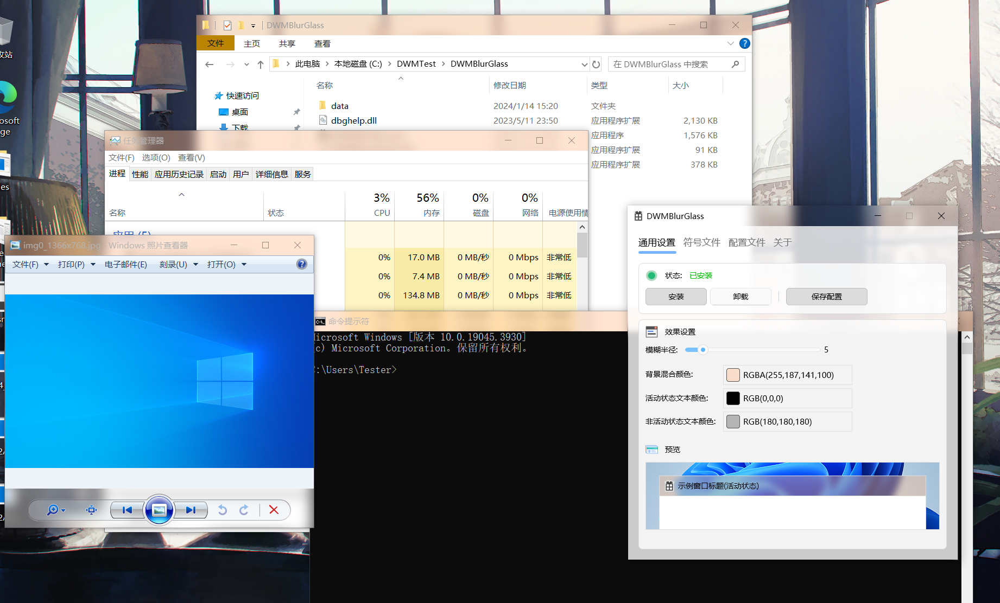
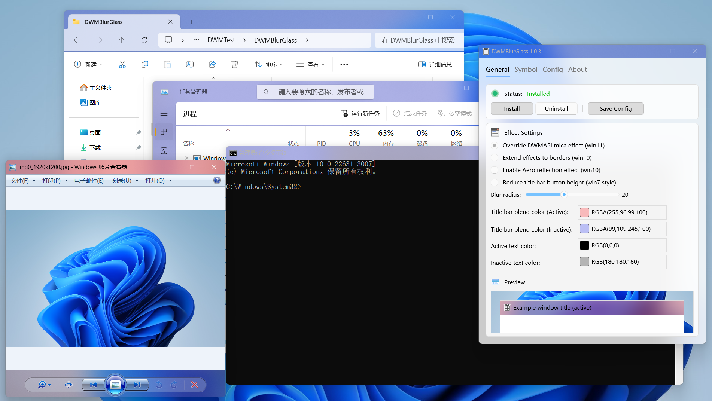

## Compatibilidade
Compatível com **Windows 10 2004** até a **última versão do Windows 11** (Alguns métodos de desfoque não são suportados em versões do Windows Insider).

Pode ser usado com temas de terceiros para personalizar ainda mais o DWM.

Não modificamos a lógica de renderização do próprio aplicativo, o que é completamente diferente da lógica do MicaForEveryone e, portanto, maximiza a compatibilidade com programas de terceiros.

Nós analisamos o DWM e criamos um método de blur personalizado para trazer efeitos visuais impressionantes, mas se você escolher o método de blur "`SystemBackdrop`" ele usa as interfaces públicas do sistema e tem o mesmo efeito que o MicaForEveryone.

Não é recomendado o uso com o MicaForEveryone, não garantimos compatibilidade com ele.

Compatível com [ExplorerBlurMica](https://github.com/Maplespe/ExplorerBlurMica), funciona melhor em conjunto.

Compatível com [TranslucentFlyouts](https://github.com/ALTaleX531/TranslucentFlyouts). (**Deve-se notar que, embora este projeto seja compatível com TF, o EBMv2 não é totalmente compatível com o TFv2**)

## Galeria

<b>Windows 11</b>

  

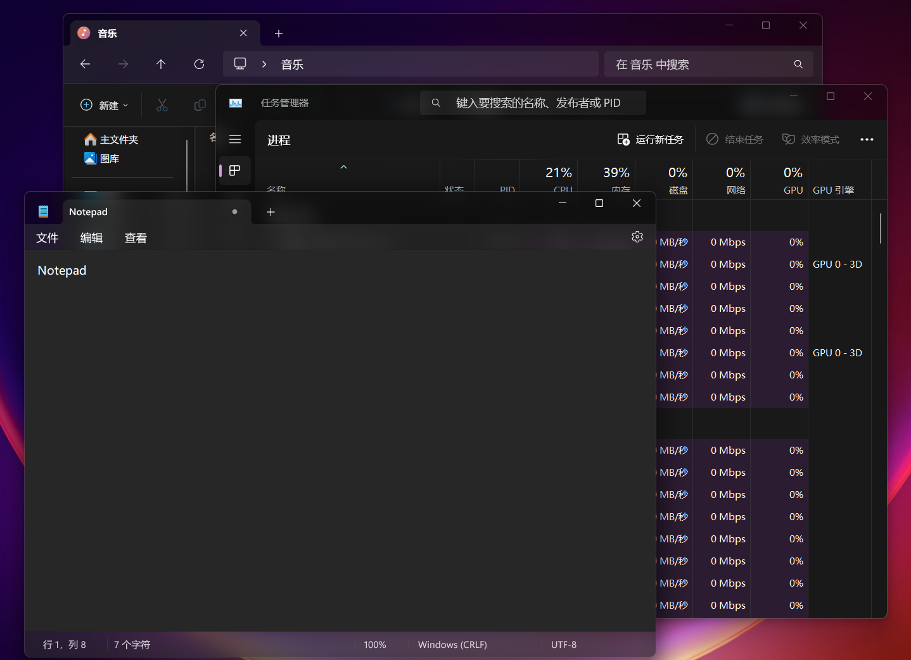

- [x] Sobreposição do efeito Mica DWMAPI (Windows 11)

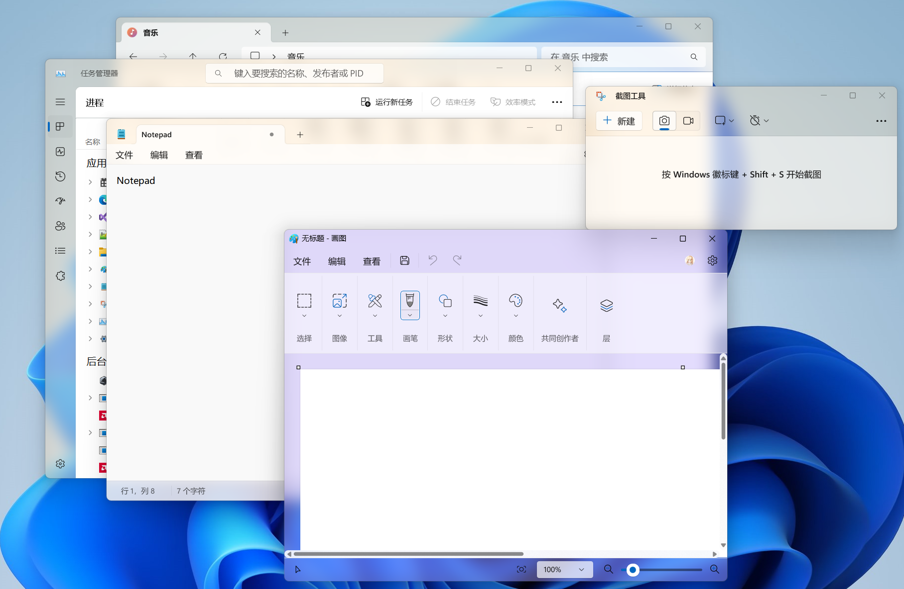

<b>Windows 10</b>

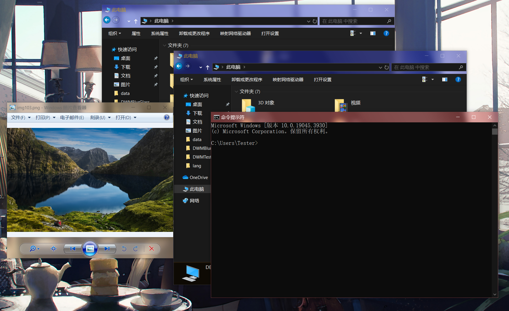

Usando temas de terceiros

- [x] Extender efeito para as bordas (Windows 10)
- [x] Efeito Reflexo Aero
- [x] Restauração da altura dos botões da barra de título no estilo do Windows 7

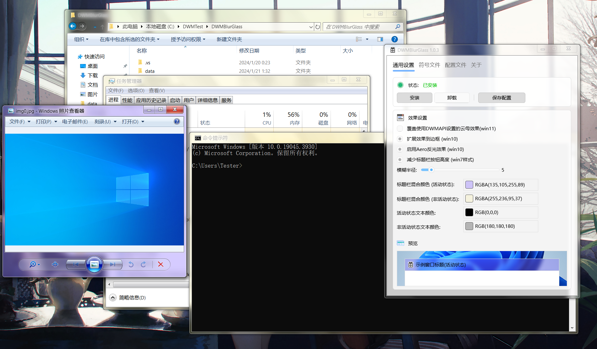

## Efeitos materiais
### Blur
> Apenas um blur básico, nada especial...

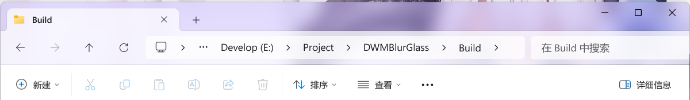

### Aero
> Efeito de vidro do Windows 7, com efeitos de saturação e exposição no fundo quando uma janela está inativa.

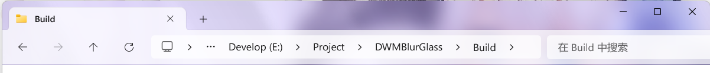

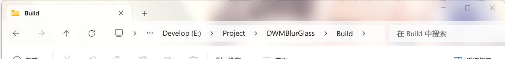

### Acrílico
> Receita do acrílico: fundo, blur, mistura de exclusão, saturação, sobreposição de cor/tom e ruído.

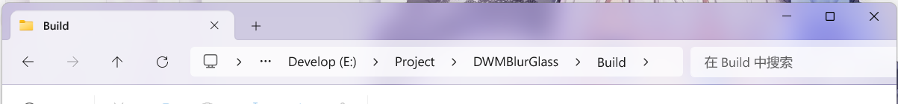

### Mica
> Receita do Mica: papel de parede desfocado, saturação e sobreposição de cor/tom.

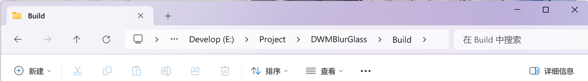

### MicaAlt
Todos os efeitos acima podem ser personalizados para mesclar cores.

MicaAlt é o Mica com um tom acinzentado, você pode modificar a cor de mesclagem por conta própria para obter o efeito MicaAlt.

## Como usar

### Instalação
1. Faça download do programa compilado em [Release](https://github.com/Maplespe/DWMBlurGlass/releases).
2. Descompacte isso em "`C:\Program Files`".

<b>3. Execute o DWMBlurGlass.exe e clique em "Instalar"</b>

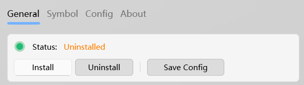

>Se nada acontecer ao clicar em "Instalar", você precisa ir na aba "Simbolos" e fazer o download.

>**Você pode receber uma notificação sobre símbolos ausentes no futuro, especialmente após atualizações do sistema.**

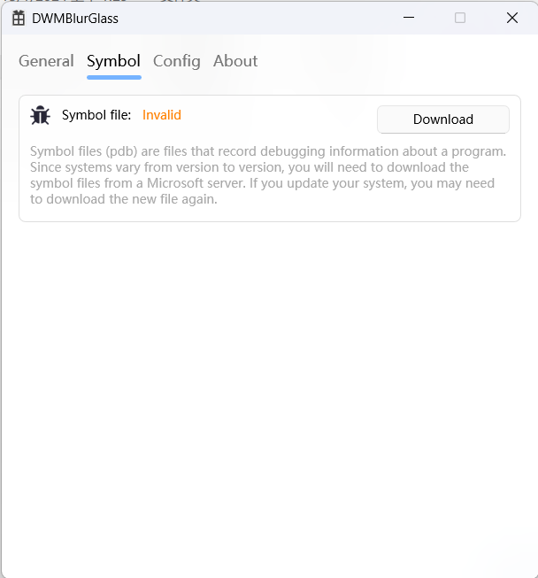

</detalhes>

### Uninstall
1. Execute o DWMBlurGlass.exe e clique em "Desinstalar".
2. Apague os arquivos relevantes

## Arquivos de linguagem
We offer several languages, such as English, Simplified Chinese, Spanish, Portuguese and more.
If you would like to help us translate into other languages, please see below for language file formats.

1. Primeiro, você precisa fazer um fork deste repositório e cloná-lo localmente.
2. Abra a pasta "`Languagefiles`" e selecione um idioma existente, como "`en-US.xml`" e faça uma cópia.
3. Renomeie o código para o nome do [idioma alvo](https://learn.microsoft.com/en-us/windows/win32/intl/locale-names) e abra o arquivo .XML em seu editor favorito.
4. Na segunda linha, no campo "`local`", altere para o código do idioma alvo, que deve ser o mesmo do nome do arquivo (sem a extensão .xml).
5. Você pode colocar seu nome no campo "`author`".
6. Em seguida, por favor, traduza os valores dos campos no formato XML (cuidado para não traduzir os nomes dos campos). O formato correto é: `<config>Config</config>` para `<config>xxxx</config>`.
7. Salve seu arquivo quando terminar e copie-o para o diretório "data\lang" na pasta onde o programa `DWMBlurGlass.exe` está localizado.
8. Depois, execute o `DWMBlurGlass.exe` e teste o arquivo de idioma para ver se funciona corretamente. Se não funcionar, verifique as configurações do código do idioma e certifique-se de que o arquivo está conforme a especificação do formato XML.
9. Finalmente, faça o commit do arquivo no seu próprio repositório forkado e envie um pull request para a branch principal do projeto.
10. Após a aprovação do request, seu arquivo será lançado com uma futura atualização de software.
   

## Dependencias
* [MiaoUI Lite interface library v2](https://github.com/Maplespe/MiaoUILite)
* [AcrylicEverywhere](https://github.com/ALTaleX531/AcrylicEverywhere) - Implementação upstream separada do método CustomBlur, graças a ALTaleX pela pesquisa e suporte.
* [minhook](https://github.com/m417z/minhook)
* [pugixml](https://github.com/zeux/pugixml)
* [VC_LTL](https://github.com/Chuyu-Team/VC-LTL5)
* [Windows Implementation Libraries](https://github.com/Microsoft/wil)
